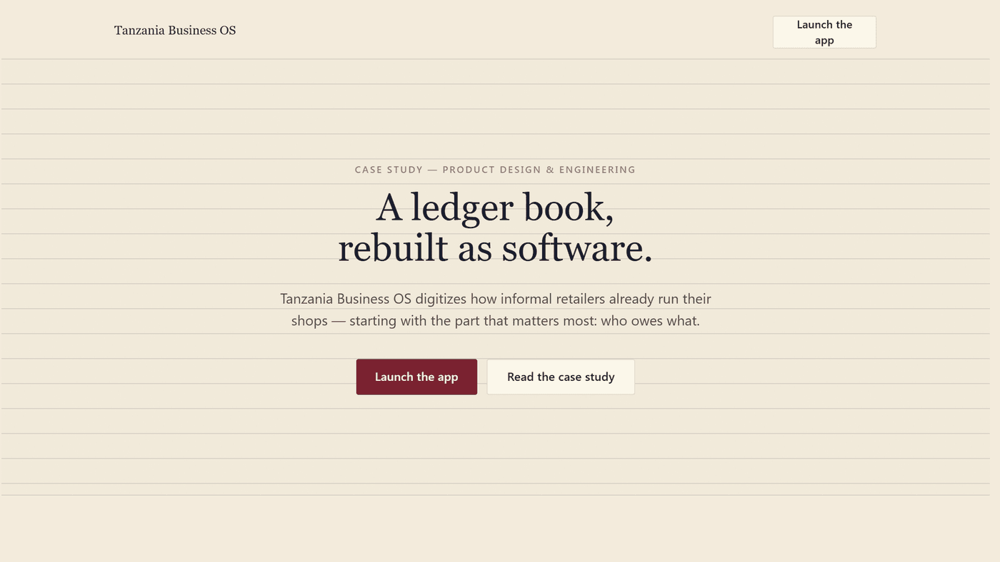
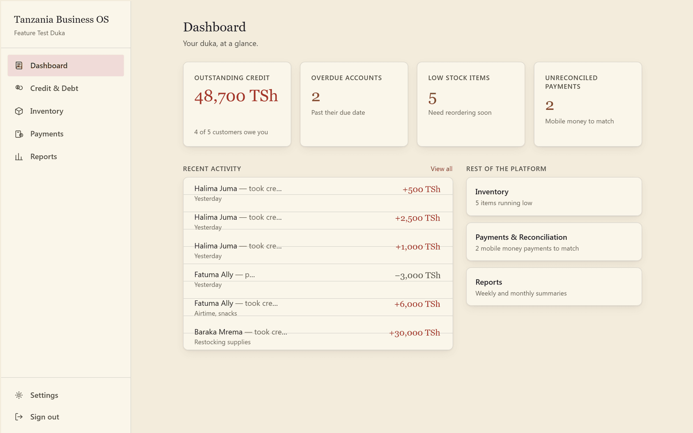
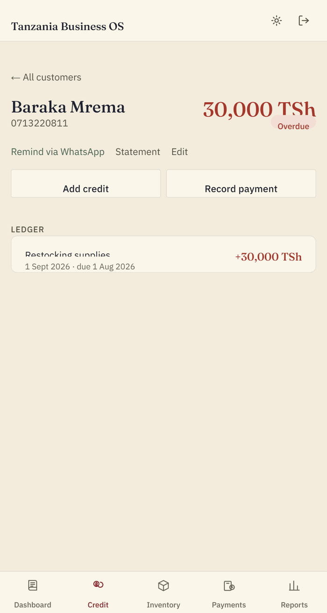

# Tanzania Business OS

A paper-and-ink business operating system for Tanzania's informal retailers (dukas) — built around the one thing that actually keeps a shopkeeper up at night: **who owes what.**

**[Live demo →](https://tanzania-business-os.vercel.app)**

<p>
  
</p>

Most "business management" software for this market is a generic POS skin bolted onto a template. This one starts from how dukawallahs already work — a paper ledger book, a WhatsApp reminder, a mental tally of who's overdue — and rebuilds that workflow as software instead of replacing it with something unfamiliar.

## What's actually live vs. what's a designed stub

This is a portfolio build, and I'd rather be upfront about scope than fake it:

| Module | Status |
|---|---|
| **Credit & Debt Tracking** | ✅ Fully functional — real Supabase database, real auth, real row-level security |
| Inventory | 🖼️ Polished, navigable UI on realistic mock data |
| Payments & Reconciliation | 🖼️ Polished, navigable UI on realistic mock data |
| Reports | 🖼️ Polished, navigable UI on realistic mock data |

The case study page (linked above) walks through that decision and the reasoning behind it. Building one module properly — real data, real security, real edge cases — demonstrates more than four shallow ones.

## Preview

| Dashboard | Customer ledger |
|---|---|
|  |  |

## Features

**Credit & Debt Tracking (live)**
- Add customers, record credit sales and payments, track running balances per customer
- Automatic overdue detection based on due dates
- Editable ledger entries with inline delete/confirm, not a separate edit page
- WhatsApp reminder links generated per customer (`wa.me` deep links with a pre-filled message)
- Per-customer statement view and CSV export
- Search/sort/filter across the customer list, with phone-number normalization so `0754 221 908` and `+255 754 221 908` resolve to the same customer instead of creating a duplicate
- Full audit trail of who changed what

**Multi-staff accounts**
- Shop owners can invite staff members with full ledger access
- Membership-based multi-tenancy (`shop_members`), not a single-owner hack
- Every write is scoped and enforced server-side via Postgres row-level security — verified by directly testing for cross-tenant data leakage, not assumed

**Account & shop management**
- Email/password auth with password reset
- Show/hide toggle on password fields
- Shop settings (name, currency display)
- Pagination and CSV export on list views

**Everything else expected of a real deployment**
- Custom error boundaries and a 404 page, not framework defaults
- Loading states per route
- SEO metadata, `robots.txt`, `sitemap.xml`, and a generated OG image
- Vercel Web Analytics + Speed Insights
- WCAG 2.1 AA contrast, checked programmatically (relative-luminance computation against the design system's actual token values, not eyeballed)
- CI on every push/PR (lint, unit tests, build)

**The landing page**
- A GSAP scroll-triggered case study explaining the product decisions, not just a features list

## How it works

**Stack:** Next.js 16 (App Router, Turbopack, Server Actions) · Supabase (Postgres + Auth + RLS) · Tailwind CSS v4 · GSAP · TypeScript · Vitest

**Multi-tenancy & security.** Every table is scoped by `shop_id` and locked down with row-level security policies, checked through a `SECURITY DEFINER` function so policies can reference shop membership without recursive-policy errors. Staff access goes through a `shop_members` join table rather than a single-owner column, so RLS covers both the shop owner and any invited staff without special-casing either. Database views (e.g. `customer_balances`) are explicitly set to `security_invoker = true` — Postgres views run as their *owner* by default, not the querying user, which is an easy way to accidentally leak cross-tenant data through a view that looks correctly scoped. This was caught and fixed during development, then re-verified with a direct query designed to try to see another shop's data.

**Data flow.** Reads happen in Server Components straight from Supabase; writes go through Server Actions using `useActionState`, so forms degrade gracefully and mutations stay colocated with the schema they touch. `revalidatePath` keeps the UI in sync after a write without a client-side data-fetching layer.

**Design system.** "Paper-and-ink instrument" — a warm paper background, ruled lines, a serif display face for numbers and headings, restrained color used only for status (overdue, positive balance, warnings). Tokens live in `app/globals.css` under Tailwind v4's `@theme inline`.

## Getting started

```bash
npm install
cp .env.local.example .env.local
```

Fill in `.env.local` with your Supabase project's URL and anon key (Project Settings → API in the Supabase dashboard). Then apply the schema in order via the Supabase SQL editor:

```
supabase/migrations/0001_init.sql
supabase/migrations/0002_fix_overdue_due_date.sql
supabase/migrations/0003_fix_view_rls_bypass.sql
supabase/migrations/0004_activity_log.sql
supabase/migrations/0005_shop_members.sql
```

This creates `shops`, `shop_members`, `customers`, `credit_entries`, `payments`, the `customer_balances` view, and the row-level security policies scoped per shop — plus a trigger that provisions a shop the moment someone signs up.

```bash
npm run dev
```

- `/` — the landing / case study page (works with no Supabase config)
- `/login` — create a shop or sign in
- `/app/dashboard` — the app shell, once signed in

## Structure

```
app/app/credit/**              the live Credit & Debt module
app/app/{inventory,payments,reports}   stubbed modules on mock data (lib/mock/)
lib/actions/                   server actions (auth, credit ledger reads/writes, team, shop)
lib/supabase/                  browser/server/proxy Supabase clients
lib/shop-context.ts            shared requireShop() — auth + membership resolution
components/landing/            the GSAP-animated case study page
supabase/migrations/           schema and RLS policies, in order
```

## Scripts

```bash
npm run dev     # start the dev server (Turbopack)
npm run build   # production build
npm run lint    # eslint
npm run test    # vitest
```
